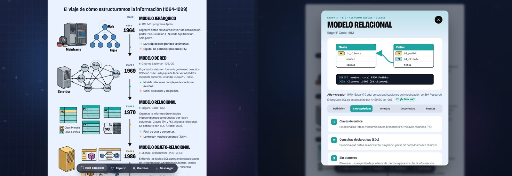

# La evolución de los modelos de datos · Infografía interactiva

**Ver la web:** https://jean1722343.github.io/infografia-modelos-de-datos/

El viaje de cómo estructuramos la información (1964–1999), contado en una infografía que se puede tocar. Recorre los cinco modelos de datos:

| Etapa | Año | Modelo | Origen |
|---|---|---|---|
| 1 | 1964 | Jerárquico | IBM IMS · programa Apolo |
| 2 | 1969 | De red | Charles Bachman · IDS / CODASYL |
| 3 | 1970 | Relacional | Edgar F. Codd · IBM |
| 4 | 1986 | Objeto-relacional | Michael Stonebraker · POSTGRES |
| 5 | 1989 | Orientado a objetos | Atkinson et al. · Manifiesto OO / ODMG |



## Cómo se usa

Es **una sola hoja de infografía**, igual a la de Canva (1536 × 2752), pero viva:

- **Toca cualquier dibujo, año, título o texto** para abrir la ficha completa del modelo: año y creador, definición, características, ventajas, desventajas y una animación que explica cómo organiza los datos.
- Al pasar el cursor, cada pieza se ilumina y muestra qué representa.
- Cada etapa se arma con su propia animación: piezas que entran, el año que cuenta, la flecha que se dibuja con datos que viajan, y los ✔ / ✘ que se estampan.
- **Cada nombre** (IBM IMS, Bachman, Codd, Stonebraker, Atkinson) tiene una etiqueta **Fuentes**: al tocarla dice de dónde sale ese dato, qué dice cada fuente consultada y su enlace. Cada ficha tiene además la pestaña **Fuentes**.
- **Autor y fuentes** es desplegable: al tocarlo se abre un panel con el equipo, las redes del desarrollador y los enlaces a las fuentes.
- Barra inferior: **Hoja completa** (ver toda la hoja en pantalla), **Repetir** la animación, **Créditos** y **Descargar** la infografía original.
- Pasa de un modelo a otro con **anterior / siguiente** o con las flechas del teclado; `Esc` cierra. Cada ficha tiene su enlace, por ejemplo `…/#relacional`.

## Tecnología

Tipografía: Manrope (textos) y Bricolage Grotesque (títulos), con Anton y Tinos en la cabecera como en el diseño original. Sitio estático en HTML, CSS y JavaScript puro, sin dependencias ni paso de compilación. Lo publica GitHub Pages.

```
index.html        estructura de la página
css/styles.css    diseño, animaciones y versión para celular
js/data.js        contenido de las fichas y las fuentes
js/app.js         maqueta de la hoja (coordenadas de Canva), animaciones y fichas
assets/pieces/    piezas de los dibujos recortadas de la exportación de Canva
assets/           la infografía original y capturas
```

Para verla en local: `python -m http.server` dentro de la carpeta y abrir http://localhost:8000

## Créditos

**Equipo 1** · Bases de Datos, Unidad 1: Introducción a las bases de datos · Universidad del Istmo

- Kevin Alexis Garcia Romero
- Alexander De Los Santos López
- Fátima Alejandra Morales Gordon
- Evelin Vázquez Rojas
- Jean Paul Gallegos Cruz (desarrollador) · [LinkedIn](https://www.linkedin.com/in/jeanpaulgc) · [Instagram](https://www.instagram.com/jpgallegosc) · [GitHub](https://github.com/Jean1722343) · [Facebook](https://www.facebook.com/profile.php?id=61593415306721) · [TikTok](https://www.tiktok.com/@jpgallegosc)

El diseño original de la infografía se hizo en Canva; la descarga está en [`assets/infografia-original.jpg`](assets/infografia-original.jpg).

## Fuentes

- [Historia de las bases de datos](https://infodigital.ciberlinea.net/sistemas/historia-de-las-bases-de-datos/) — infodigital.ciberlinea.net
- [Evolución de los modelos de datos: jerárquico, en red, relacional y orientado a objetos](https://academy-code.codingia.com/evolucion-de-los-modelos-de-datos-jerarquico-en-red-relacional-y-orientado-a-objetos/) — academy-code.codingia.com
- [Historia y evolución de las bases de datos: de 1960 a hoy](https://entidadrelacion.com/historia-bases-de-datos/) — entidadrelacion.com
- [Antecedentes históricos (PostgreSQL)](https://jordinponc.blogspot.com/2017/02/antecedentes-historicos.html) — jordinponc.blogspot.com
- [Breve historia del nacimiento de las bases de datos](https://click-it.es/breve-historia-del-nacimiento-de-las-bases-de-datos/) — click-it.es
- Codd, E. F. (1970). *A Relational Model of Data for Large Shared Data Banks*. Communications of the ACM, 13(6).
- Bachman, C. W. (2009). *The Origin of the Integrated Data Store (IDS)*. IEEE Annals of the History of Computing.
- Atkinson, M. et al. (1989). *The Object-Oriented Database System Manifesto*.
